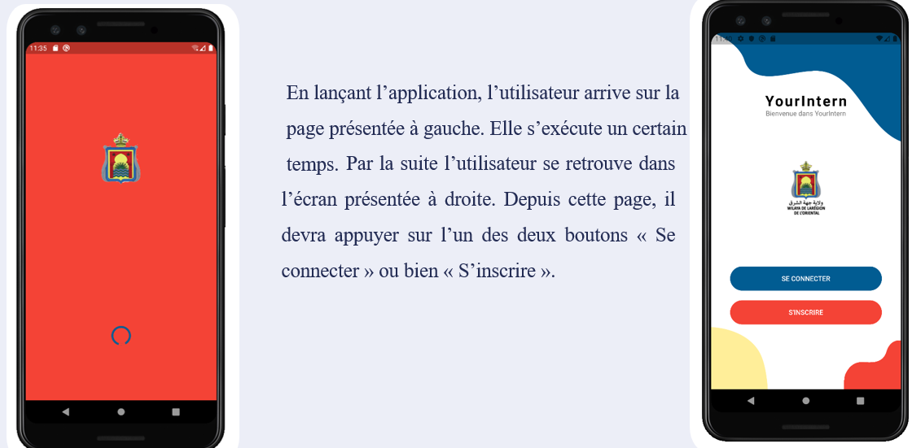
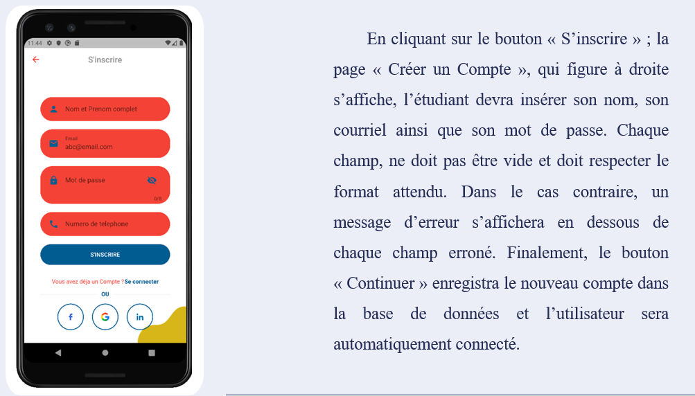
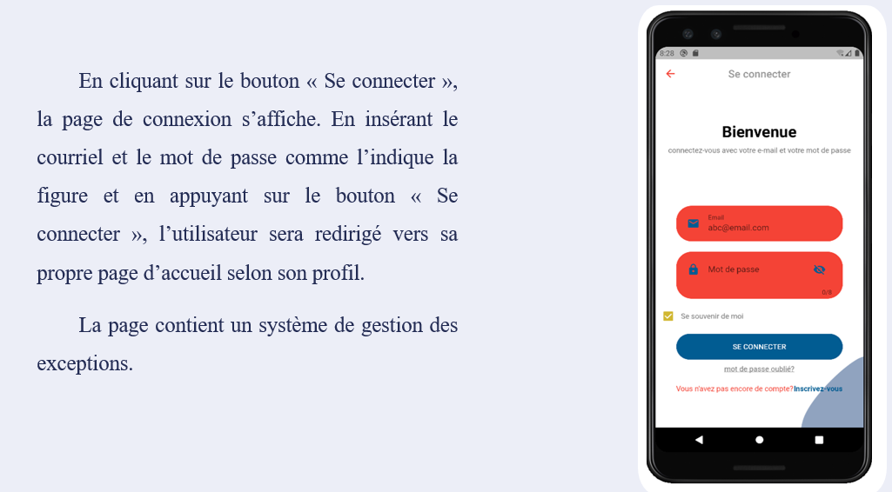
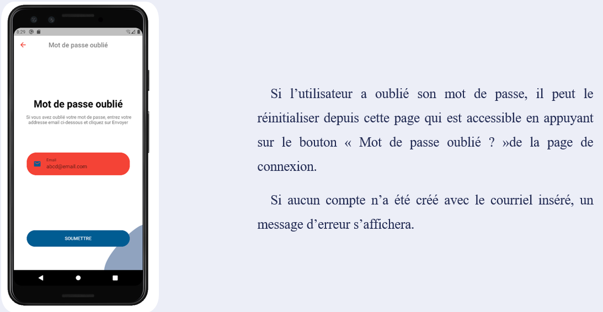
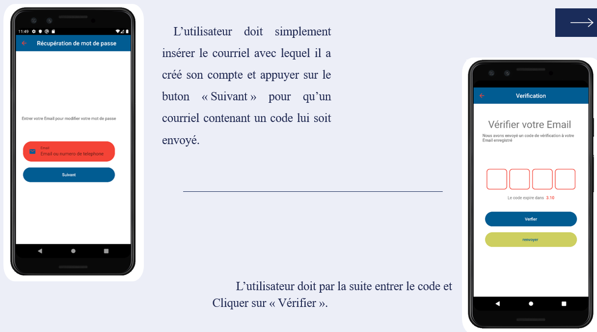
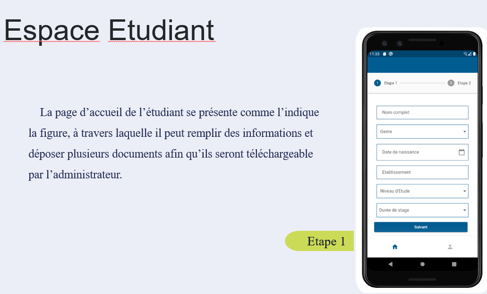
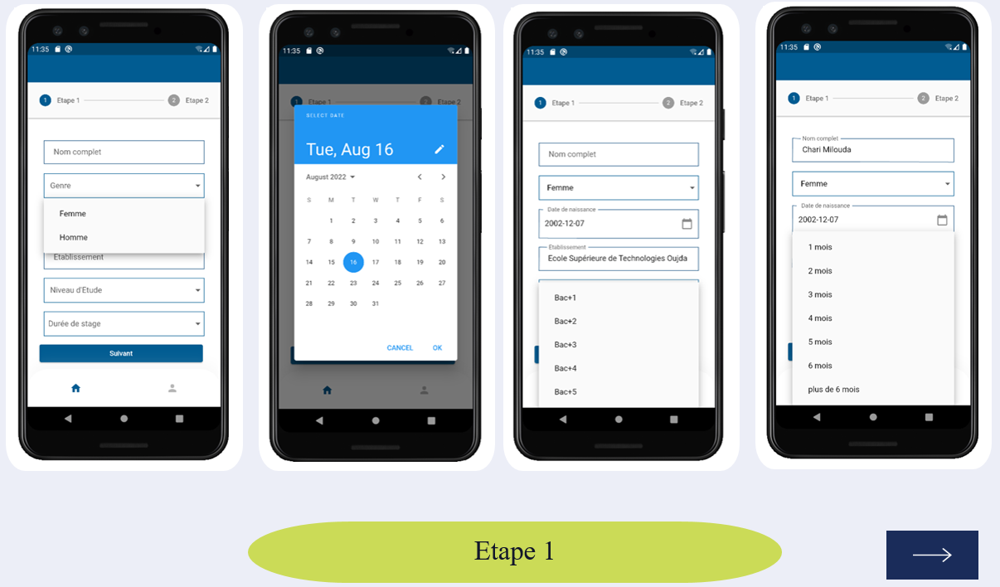
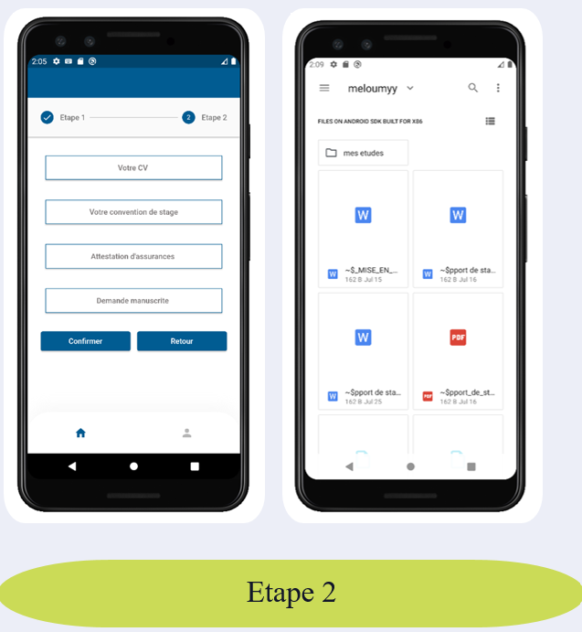
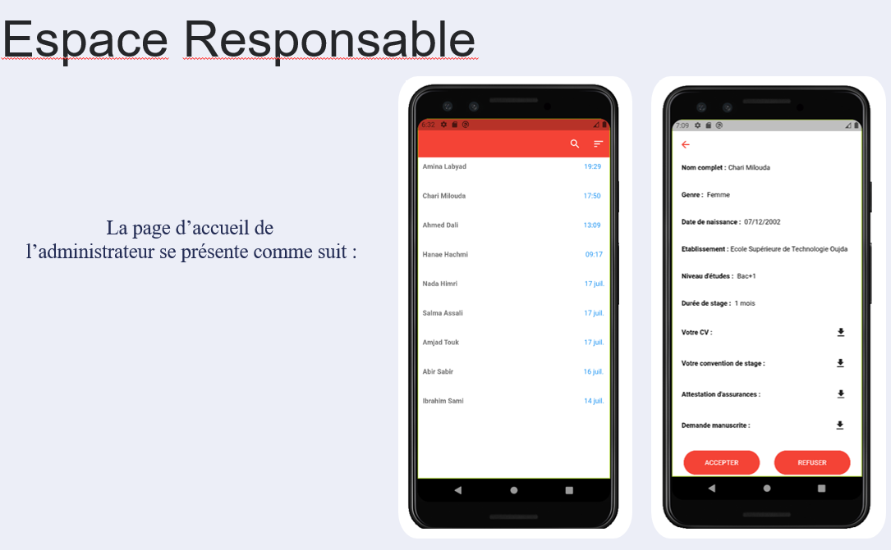
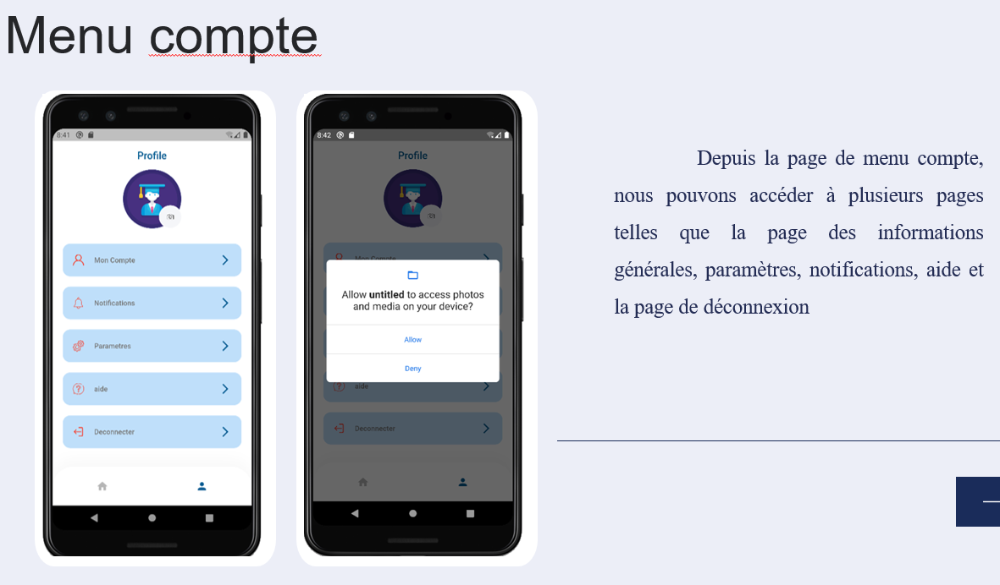

# GestionDemandeStage : **YourIntern**
Une application mobile pour la gestion des demandes de stage
## Sommaire
1. [Présentation de l'équipe](#1-présentation-de-léquipe)
2. [Problématique](#2-pourquoi-cette-application-)
3. [Fonctionnalités](#3-fonctionnalités)
4. [Technologies Utilisées](#4-technologies-utilisées)
5. [Captures d'écran](#5-captures-decran)
---
## 1. Présentation de l'équipe 
```
Encadrant  :  M. ZENATI Jaouad
Réalisé par :  
   > CHARI Milouda             
```

## 2. Pourquoi cette application ?  
La préfecture d’Oujda-Angad a besoin d’informatiser le processus de gestion des demandes de stage. Il s’agit de la conception et la réalisation d’une application mobile qui va faciliter la gestion des demandes de stages et qui permet aux étudiants le dépôt des demandes et aux responsables la manipulation de ces demandes.
## 3. Fonctionnalités
- L’application offre à l’utilisateur les fonctionnalités suivantes : Une interface de bienvenue qui comporte le logo de la wilaya et deux boutons pour le choix entre la connexion et création compte. 
- Mon application fait la distinction entre un utilisateur normal et l’administrateur ; l’accès aux différentes pages diffère selon les droits d’accès de chaque utilisateur. C’està-dire que une fois l’utilisateur est connecté, il sera redirigé vers sa propre page d’accueil selon son profil :
  
Pour un étudiant : 

il lui apparait une page qui va lui permettre le remplissage d’un formulaire, en effet, le processus se décompose en 2 étapes : l’étape 1 : consiste à l’introduction des informations générales sur l’étudiant tel que l’établissement, niveau d’études, durée de stage … Etape 2 : consiste à attacher des documents nécessaires pour la demande de stage. 

Pour un responsable : 

on lui affiche la liste des demandes triées par ordre d’envoi. Il va manipuler les demandes en cliquant sur l’un des deux boutons : accepter/ refuser. Une interface « menu compte » qui va permettre aux utilisateurs l’accès aux différentes pages (déconnexion, notifications…)
## 4. Technologies utilisées
   Dart(Flutter)
   Firebase
   Android studio
   Visual Studio Code
   PowerAMC
  
## 5. Captures d'ecran
   
 










